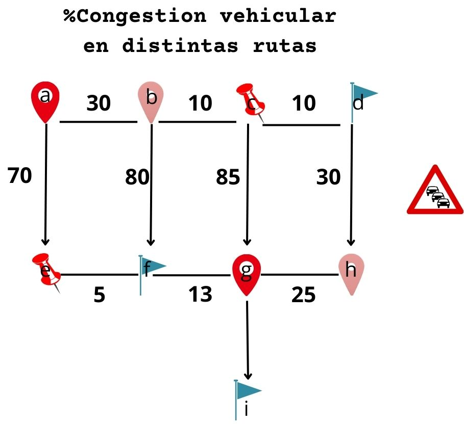

# Application-of-graph-theory
### Se plantea una aplicación de rutas, para automóvil, bici, etc. La aplicación debe encontrar el camino con menos congestión vehicular(La definirá el peso de las conexiones), para esto, tomará el peso de las conexiones entre vértices y elegirá el camino más corto(menos peso) hasta el vértice destino.

